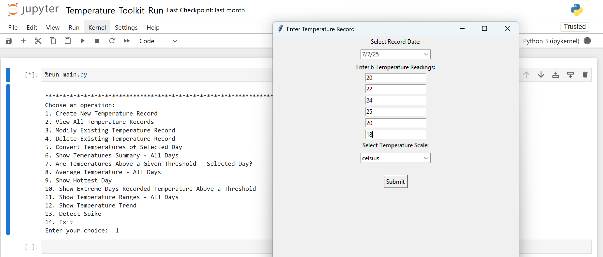
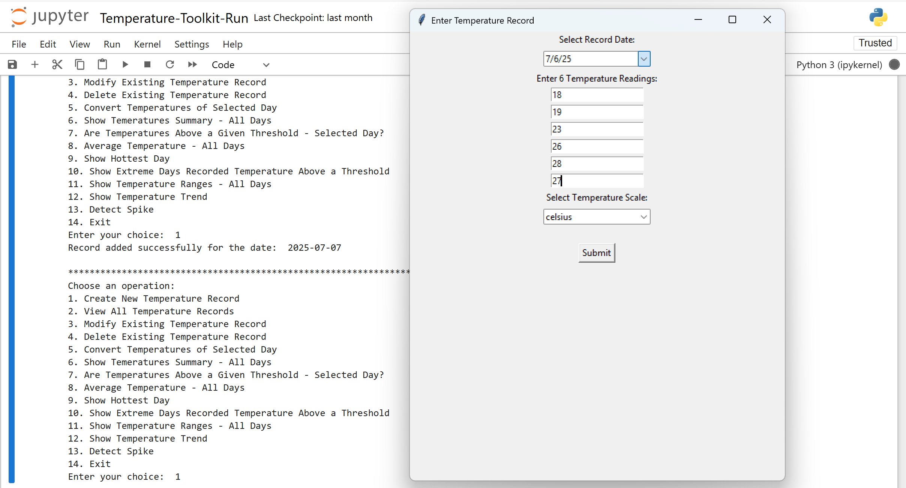
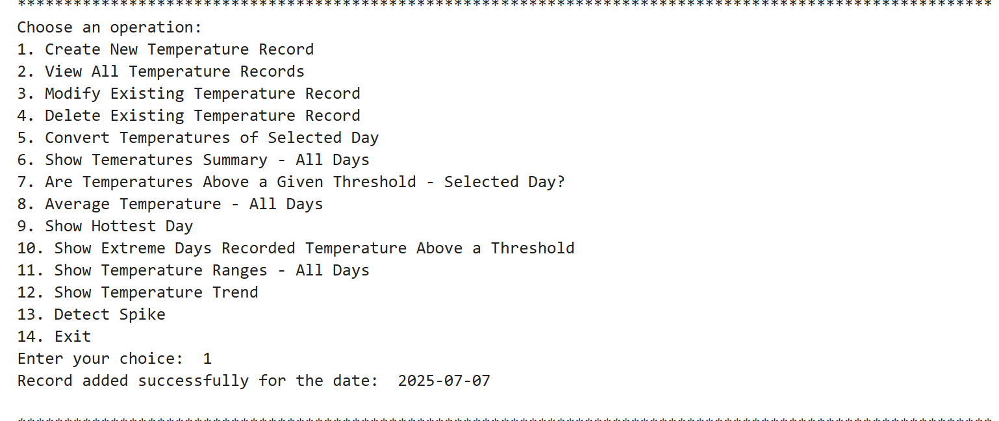
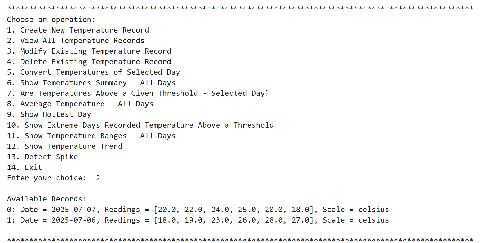
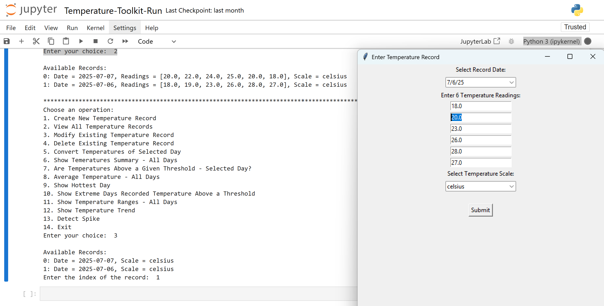
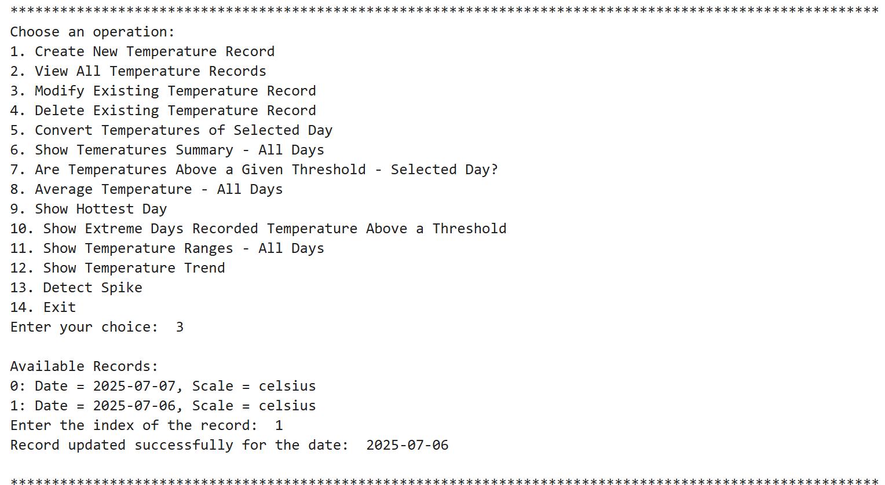

# 🚀 Temperature Toolkit – Python Project

I'm excited to share my recent Python project – a **Temperature Toolkit** developed using core Python! 🌡️📊

## 🔍 Project Highlights

✅ Built an interactive **Temperature Toolkit** with a **menu-driven CLI**  
✅ Records are stored in memory using Python **lists/arrays**  
✅ The tool allows users to:
- Create, update, and delete temperature records  
- Convert temperatures for specific dates  
- Analyze trends, averages, and temperature spikes  
- Display summaries, hottest day, extreme days, and more!

## 🛠️ Tools & Skills Used

- Python  
- Data Structures (Lists)  
- Control Flow (Loops, Conditionals)  
- CLI (Command-Line Interface) Design

## 📁 Project Structure
```text
Temperature-Toolkit/
│
├── main.py                                   # Main script to run the CLI Temperature Toolkit
├── Test-Temperature-Toolkit.ipynb            # Jupyter Notebook for testing or demo
│
├── temperature_toolkit/                      # Core package directory
│   ├── __init__.py                           # Makes the folder a Python package
│   ├── analytics.py                          # Functions for analyzing temperature data
│   ├── converter.py                          # Handles temperature unit conversions
│   ├── crud_temperature_records.py           # CRUD operations for temperature records
│   ├── generalutils.py                       # Shared utility/helper functions
│   ├── record.py                             # Defines the Temperature Record class
📝 Note: .ipynb_checkpoints/ and __pycache__/ are auto-generated and can be ignored.
```


## 📄 **File Description**
- **main.py**: Entry point for the CLI program. Displays the menu and handles user input.
- **Test-Temperature-Toolkit.ipynb**: Jupyter notebook to test and demonstrate toolkit functionality.
- **temperature_toolkit**
    - **__init__.py**: Initializes the package so it can be imported as a module.
    - **analytics.py**: Analyzes temperature records (e.g., averages, trends, spikes).
    - **converter.py**: Handles temperature unit conversion logic.
    - **crud_temperature_records.py**: Manages create, read, update, and delete (CRUD) operations.
    - **generalutils.py**: Utility functions shared across different modules.
    - **record.py**: Defines the structure of a temperature record using a class.
## ▶️ **Sample Usage**
After running main.py, you will see a menu-driven interface like:
Choose an operation:
1. Create New Temperature Record
2. View All Temperature Records
3. Modify Existing Temperature Record
4. Delete Existing Temperature Record
5. Convert Temperatures to different scale of Selected Day
6. Show Temperature Summary - All Days
7. Check If Temperatures Are Above a Threshold (Selected Day)
8. Average Temperature - All Days
9. Show Hottest Day
10. Extreme Days Above a Threshold
11. Show Temperature Ranges - All Days
12. Show Temperature Trend
13. Detect Spike
14. Exit

🖊️ Just type the number for the desired operation and follow the prompts!

## 📸 **Feature Demonstration**
1️⃣ Create New Temperature Record

**Record-1:**


**Record-2:**


**Result Post Temperature Record Creation:**


---

2️⃣ View All Temperature Records



---

3️⃣ Modify Existing Temperature Record





---

## 5️⃣ Convert Temperatures of Selected Day


---

## 6️⃣ Show Temperature Summary - All Days


---

## 12️⃣ Show Temperature Trend


## ⚙️ **How to Run Locally**
1. **Clone the repository:**
    1. git clone https://github.com/username/temperature-toolkit.git
    2. cd temperature-toolkit
2. **Run the main script:**
    python main.py
3. **(Optional) Open the Jupyter Notebook for testing:**
    jupyter notebook Test-Temperature-Toolkit.ipynb
## 📚 **Learning Outcomes**
This project helped me:

🧠 Strengthen core Python skills

📋 Practice list-based data handling

🔁 Build reusable, modular code using OOP principles

💻 Design a user-friendly, menu-driven CLI tool